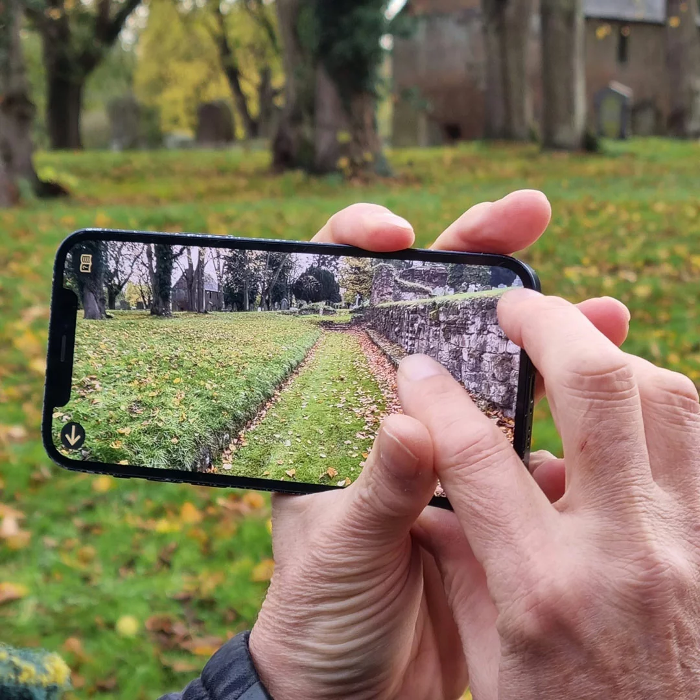
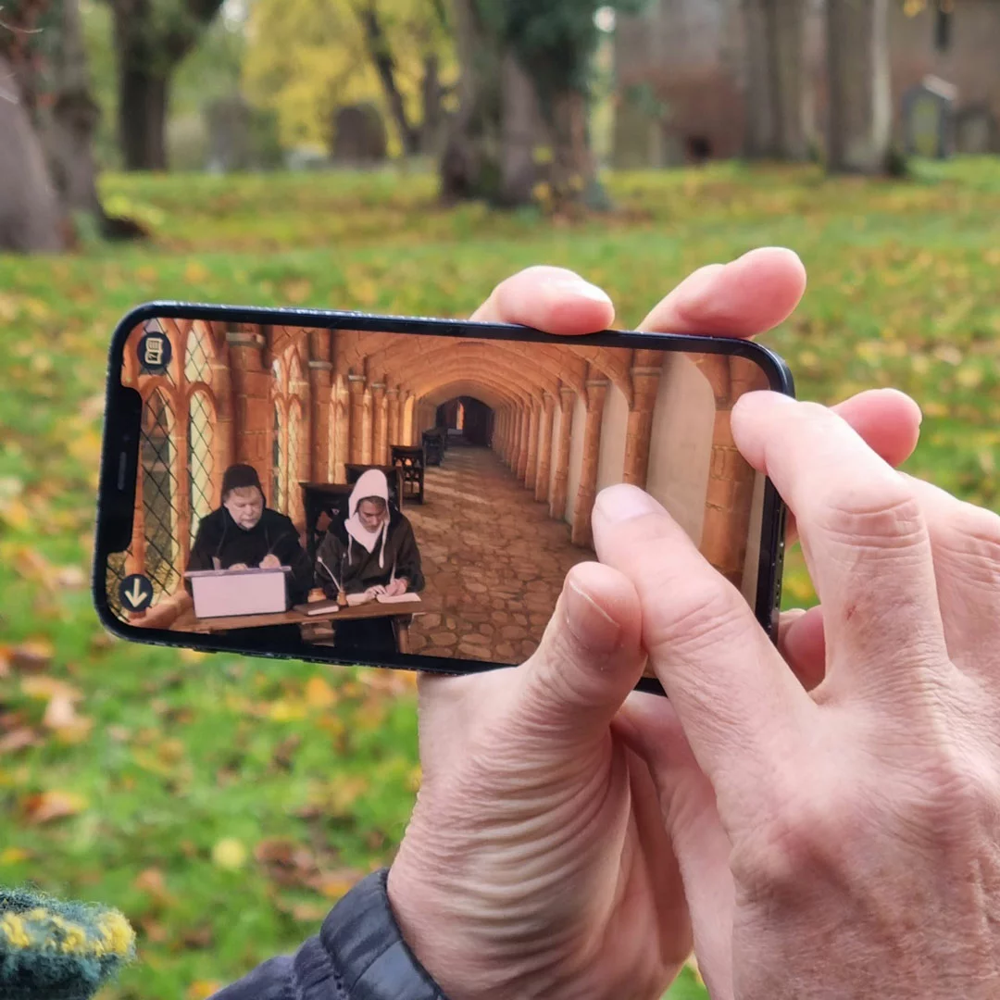

MyJAMS contributed to Kenilworth Revealed, an augmented reality project that uncovers the hidden stories of Kenilworth. Through interactive technology, visitors can explore the town's history in a new and engaging way.

The project is an example of how MyJAMS technology can support heritage, education, and immersive public engagement. Kenilworth Town Council describes how people filmed by MyJAMS Ltd / University of Birmingham were inserted into the reconstructed medieval environment, while [Zubr's project case study](https://zubr.co/case-study/kenilworth-revealed/) explains how filmed historical characters were embedded into the AR experience alongside 3D reconstructions and spatial audiovisual scenes.

## Rebuilding St Mary's Abbey

This interactive view shows how the Kenilworth Revealed experience connects the present-day Abbey Fields with a reconstructed medieval cloister scene.

  
  

    
  

  <input class="comparison-slider__range" type="range" min="0" max="100" value="50" aria-label="Compare reconstructed and present-day views">
  

    
  

  
Then

  
Now

Examples of the technology in use:

- [Kenilworth Town Council launch article](https://kenilworth-tc.gov.uk/kenilworth-revealed-augmented-reality-app-brings-history-to-life-and-visitors-to-the-town/)
- [Zubr case study: Kenilworth Revealed](https://zubr.co/case-study/kenilworth-revealed/)
- [Kenilworth Revealed visitor page](https://visit.kenilworthweb.co.uk/discover/kenilworth-revealed/)
